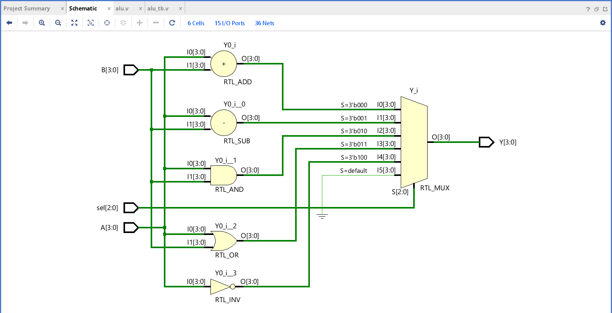
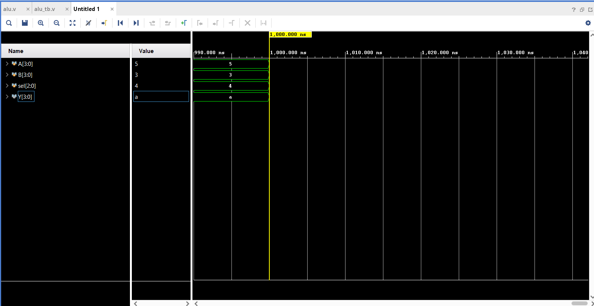

# 🔢 Arithmetic Logic Unit (ALU) – Verilog | Vivado

This project implements a 4-bit Arithmetic Logic Unit (ALU) in Verilog HDL using Xilinx Vivado. It performs basic arithmetic and logic operations—Addition, Subtraction, AND, OR, and NOT—based on a 3-bit selection input. The ALU is tested using a Verilog testbench and verified through waveform simulation.

## ⚙️ Features

- **Inputs:**
  - `A[3:0]` – 4-bit operand A
  - `B[3:0]` – 4-bit operand B
  - `sel[2:0]` – 3-bit control signal

- **Operations:**
  | `sel` | Operation      | Description          |
  |-------|----------------|----------------------|
  | 000   | A + B          | Addition             |
  | 001   | A - B          | Subtraction          |
  | 010   | A & B          | Bitwise AND          |
  | 011   | A | B          | Bitwise OR           |
  | 100   | ~A             | Bitwise NOT (A only) |

- **Output:**
  - `Y[3:0]` – 4-bit result

## 📁 File Structure

```
├── alu.v              # Verilog ALU design
├── alu_tb.v           # Verilog testbench for ALU
├── alu.xpr            # Vivado project file
├── rtl_schematic.png  # RTL schematic diagram (Vivado output)
├── simulation.png     # Simulation waveform output
```

## 🧪 Simulation

The testbench tests all 5 operations by varying `sel` input and keeping A = 5 (0101) and B = 3 (0011). The waveform confirms expected results. Example:

- **Input:** A = 0101, B = 0011, sel = 100  
- **Operation:** ~A → 1010  
- **Output (Y):** `a` in hex (✔ Correct)

## 🖼️ RTL Schematic



## 🖥️ Simulation Output




## 🚀 How to Run

1. Open Vivado and create a new project.
2. Add `alu.v` and `alu_tb.v` as source and simulation files.
3. Run Behavioral Simulation.
4. View waveform output and RTL schematic.

## 📜 License

This project is open-source and free to use for learning and academic purposes.
